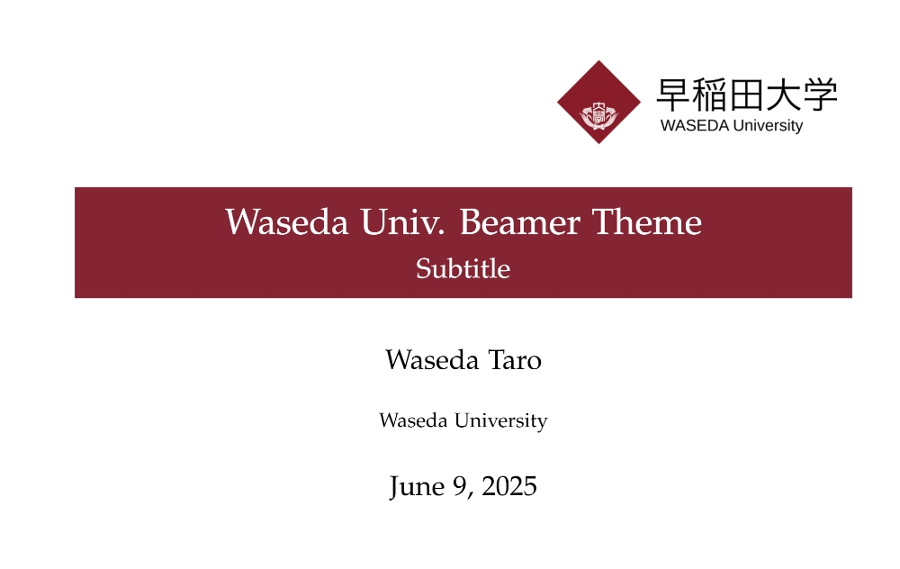

# Waseda University Beamer Theme
This is a simple Beamer presentation template designed for academic talks, thesis defenses, and seminars at **Waseda University**.

## Preview
You can preview this theme template in `Example.pdf` 


## Project Structure
```
├── utils/
│   └── waseda-university-logo.png       # logo
├── slide.tex                            # Main LaTeX source file
└── wsd.sty                              # Custom Beamer style file
```
`slide.tex` is the main file to compile and edit.  
It uses the custom style `wsd.sty` and the logo located in `utils/`.

## Usage
Compile using `pdfLaTeX` (default on Overleaf).

